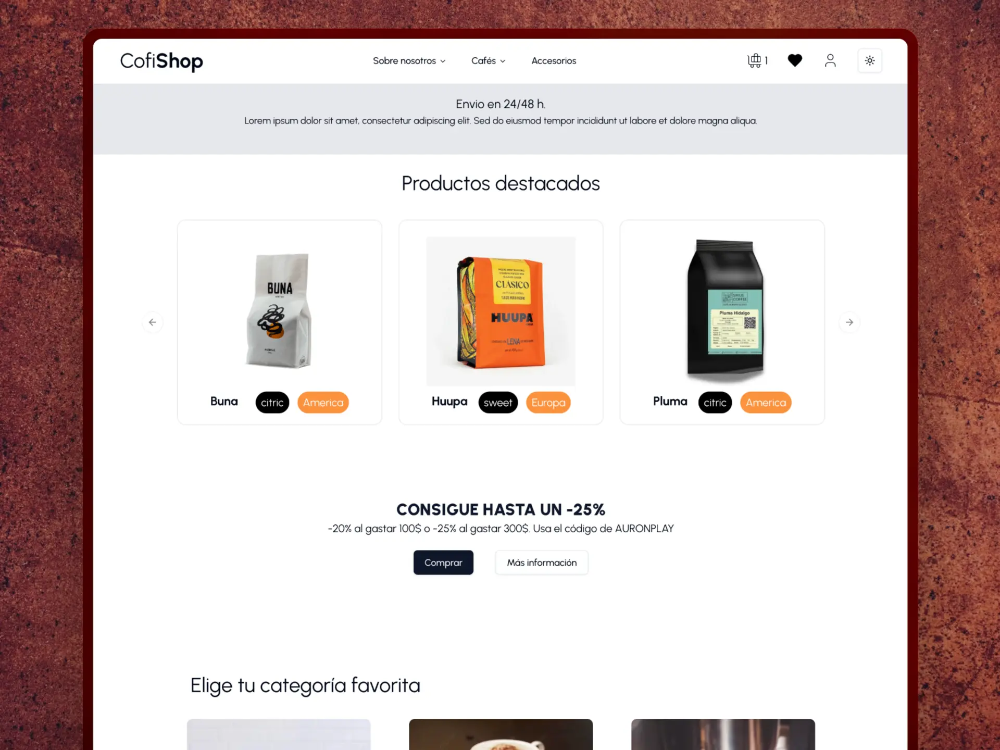

## CofiShop

This is a [Next.js](https://nextjs.org) project using [Strapi](https://strapi.io/) as backend.

## Getting Started

First, run the development server:

```bash
npm run dev
# or
yarn dev
# or
pnpm dev
# or
bun dev
```

Open [http://localhost:3000](http://localhost:3000) with your browser to see the result.

Make sure that you already had a Strapi instance up and running. [Here](http://) the schema needed.


## Screenshot



